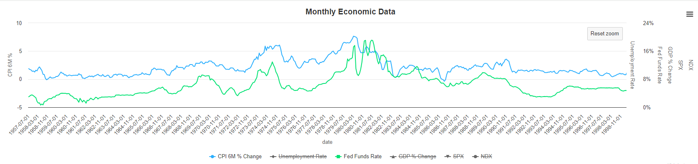

# Observations

The Fed post-2000 is much different than pre-2k. Prior to 2000 the rate raises were much more volatile. Since 2000 the fed has not hiked rates after a pause no matter what inflation did, whereas prior to that they seemed much more reactive and there were wild swings up and down.

